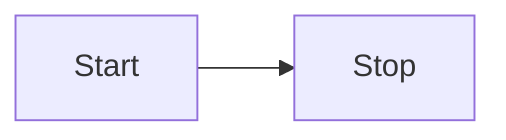
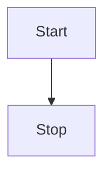
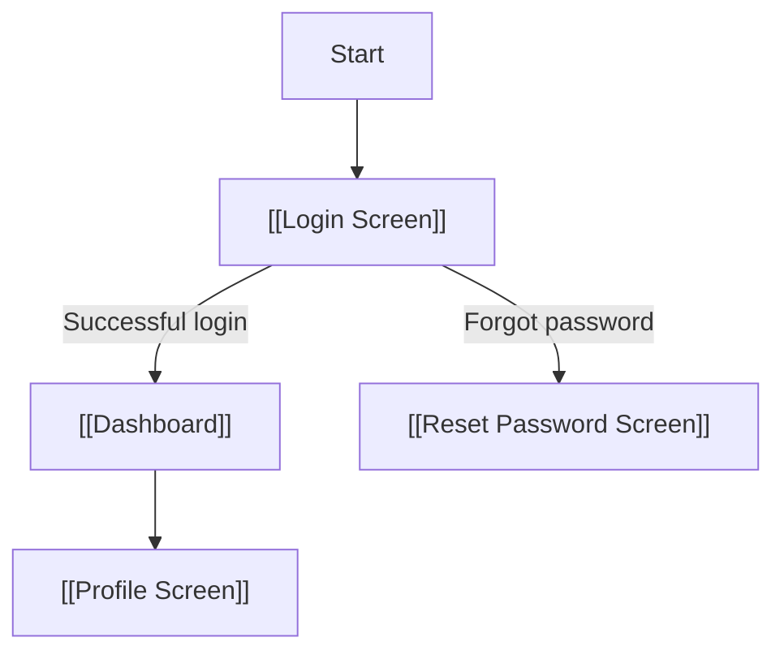

# {{title}}  <!-- Screen / Component Name -->

**Date Created:** {{date}}
**Author:** {{author}}

---

## **Purpose**
Briefly describe the purpose of this screen or component.  
Example: "Allows users to log in to the app."

---

## **User Flow (Interactive)**


```mermaid
flowchart TB
    %% Login Screen layout example
    H[Header: "Login"]
    I[Input: Email]
    P[Input: Password]
    S[Login Button]
    L[Footer: Links]

    %% Layout connections
    I --> P
    P --> S

    %% Optional: create a "subgraph-like" visual grouping using labels only
    classDef loginScreen fill:#f9f,stroke:#333,stroke-width:1px;
    class H,I,P,S,L loginScreen;
```
```